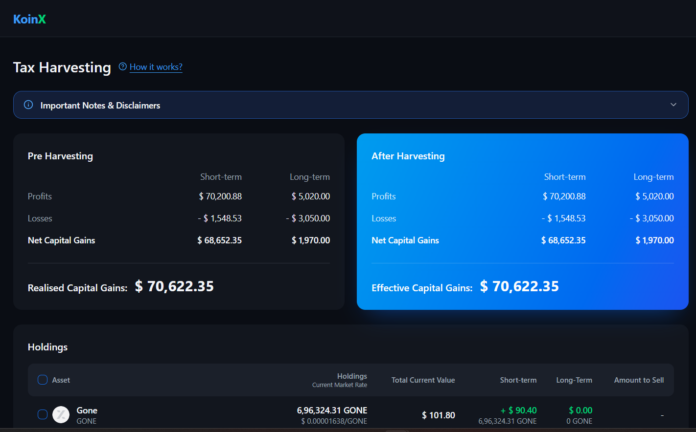
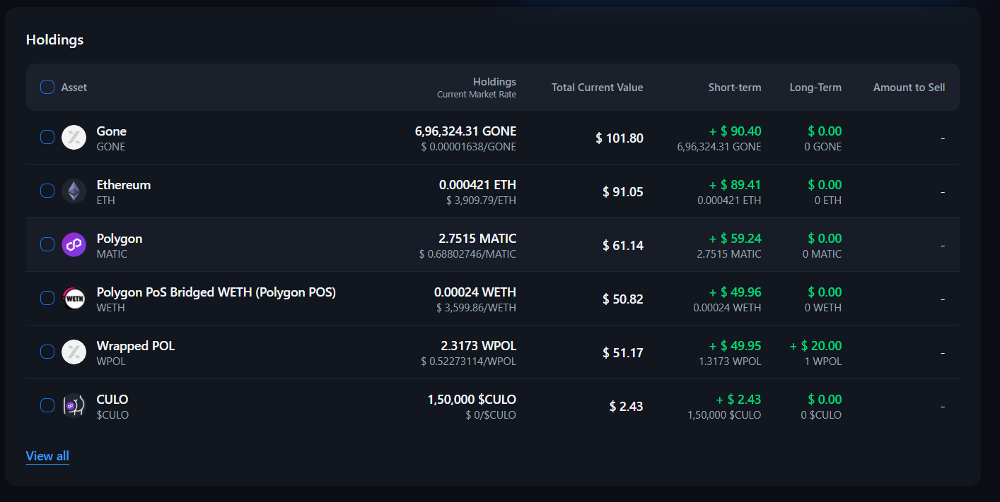

# Tax Loss Harvesting

A responsive React application that helps users visualize crypto capital gains before and after tax-loss harvesting. Users can select holdings and see the potential impact on their realized gains and estimated tax savings in real time.

## Features

- View pre-harvesting capital gains
- View post-harvesting capital gains
- Select individual crypto holdings for harvesting
- Select or deselect all holdings
- Real-time gain and loss recalculation
- Potential savings calculation
- Short-term and long-term gain tracking
- "View all" holdings expansion
- Loading skeletons
- Error handling with retry functionality
- Responsive user interface

## Tech Stack

- React
- TypeScript
- Vite
- Tailwind CSS
- Radix UI / shadcn-style UI components
- Lucide React

## Setup Instructions

### 1. Clone the repository

```bash
git clone <your-repository-url>
cd Tax-Advisor
```

### 2. Install dependencies

```bash
npm install
```

### 3. Start the development server

```bash
npm run dev
```

The application will be available at:

```text
http://localhost:5173
```

## Build for Production

To create a production build:

```bash
npm run build
```

To preview the production build locally:

```bash
npm run preview
```

## Project Structure

```text
src/
├── components/
│   ├── tax/
│   │   ├── DisclaimerPanel.tsx
│   │   ├── GainsCards.tsx
│   │   └── HoldingsTable.tsx
│   │
│   └── ui/
│       └── ...
│
├── hooks/
│
├── lib/
│   ├── tax/
│   │   ├── api.ts
│   │   ├── calculations.ts
│   │   └── types.ts
│   │
│   └── utils.ts
│
├── App.tsx
├── main.tsx
└── styles.css
```

## Screenshots

### Main Interface

```markdown

```


### Holdings Selection

```markdown

```

## How It Works

The application compares capital gains before and after tax-loss harvesting.

1. Holdings and capital gains data are loaded from the application's mock API.
2. The **Pre Harvesting** card displays the original capital gains.
3. Users select holdings they want to consider selling.
4. Selected holdings are included in the harvesting calculation.
5. The **After Harvesting** card updates in real time.
6. Potential savings are displayed when the realized gains decrease.

## Assumptions

- Holdings and capital gains data are currently provided through mock, promise-based APIs with simulated latency.
- Positive gains are treated as profits.
- Negative gains are treated as losses.
- Amounts are displayed using the `$` symbol with Indian digit grouping to match the provided design.
- Holdings are sorted based on the absolute short-term gain to prioritize positions with a potentially larger harvesting impact.
- Duplicate coin tickers are handled using index-based keys.
- The savings value is displayed only when harvesting reduces the realized net gains.
- This application is intended for demonstration and educational purposes and should not be considered financial or tax advice.

## Disclaimer

The calculations and results shown in this application are for demonstration purposes only. Tax rules can vary depending on jurisdiction, asset type, holding period, and individual circumstances.

Always consult a qualified tax or financial professional before making investment or tax-related decisions.